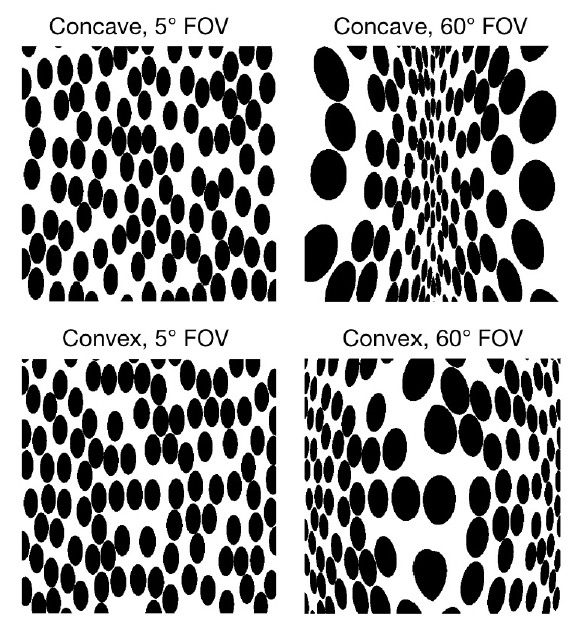
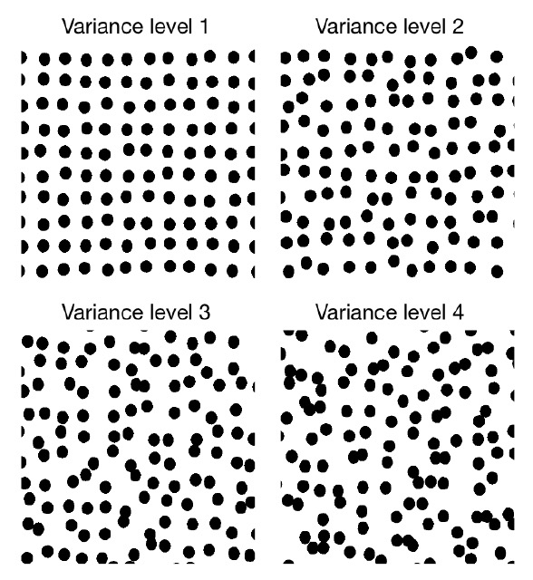

# On Human-like Biases in CNNs for the Perception of Slant from Texture

### Paper | [Poster](https://shorturl.at/guLP6)

## Description
[Yuanhao Wang](https://github.com/HarryWang355),
[Qian Zhang](https://qianzhanginfo.github.io/),
Celine Aubuchon,
Jovan Kemp,
Fulvio Domini,
[James Tompkin](https://jamestompkin.com/)

Official codebase for "On Human-like Biases in Convolutional Neural Networks for the Perception of Slant from Texture".

Paper accepted for publication at ACM Transactions on Applied Perception (TAP).

## Abstract

> Depth estimation is fundamental to 3D perception, and humans are known to have biased estimates of depth.
> This study investigates whether convolutional neural networks 
> (CNNs) can be biased when predicting the sign of curvature and depth of surfaces of textured surfaces under 
> different viewing conditions (field of view) and surface parameters (slant and texture irregularity). 
> This hypothesis is drawn from the idea that texture gradients described by local neighborhoods—a cue identified 
> in human vision literature—are also representable within convolutional neural networks. 
> To this end, we trained both unsupervised and supervised CNN models on the renderings of slanted surfaces with 
> random Polka dot patterns and analyzed their internal latent representations. The results demonstrated that the 
> unsupervised models have similar prediction biases as humans across all experiments, while supervised CNN models do not exhibit 
> similar biases. The latent spaces of the unsupervised models can be linearly separated into axes representing field 
> of view and optical slant. For supervised models, this ability varies substantially with model architecture and the 
> kind of supervision (continuous slant vs. sign of slant). Even though this study says nothing of any shared mechanism, 
> these findings suggest that unsupervised CNN models can share similar predictions to the human visual system.

## Project Overview

### Stimuli

We generate training data by rendering random Polka dot textures on surface with concave or convex dihedral angles.
In the first dataset (sample images on the left), we control the camera field of view (FOV) and the optical slant;
in the second dataset (sample images on the right), we additionally add texture irregularity as a controlled variable.

    
    &nbsp; &nbsp; &nbsp; &nbsp;
    

## Required packages

To run the codes, please install a recent version of Pytorch, and the following packages:
opencv, pandas, matplotlib, argparse, sklearn, scipy, rsatoolbox， statsmodels, datetime.

Todo: create and test a requirements.txt file

## Training Data

Training data can be downloaded from [here](https://drive.google.com/drive/folders/1n5_23rYJzJLuRihrzslswOgLKpKk_qUR?usp=sharing). 
Or, they can be generated using our scripts as following:

To generate the default dataset, run
    
    python3 gen_data_1.py

To generate the dataset with varying texture irregularities, run

    python3 gen_data_2.py

## Reproducing the results

### Train unsupervised models

Run the following script for training UNet, UNet- and AE_VGG models:

    python3 train_unsupervised.py --model_name unet --dataset data_exp1  --latent_dim 64 --nb_epochs 50 --sample_interval 25 --save_interval 25 --lr 0.0002 --batch_size 32
"model_name" argument can be one of "unet", "unet-" or "AE_vgg", 
and "dataset" argument can be one of "data_exp1" or "data_exp2".

Run the following script to train the VAE model:

    python3 VAE.py --dataset data_exp1 --latent_dim 64 --nb_epochs 50 --sample_interval 25 --save_interval 25 --lr 0.001 --batch_size 32

### Train supervised models

Run the following script to train supervised models:
    
    python3 train_supervised.py --model_name supervised_sign --backbone unet --dataset data_exp1  --latent_dim 64 --nb_epochs 50 --sample_interval 25 --save_interval 25 --lr 0.0002 --batch_size 32

"model_name" argument can be one of "supervised_sign" or "supervised_slant", each for a different
supervision signal; "backbone" can be one of "unet" or "resnet18"; "dataset" can be one of "data_exp1"
or "data_exp2".

