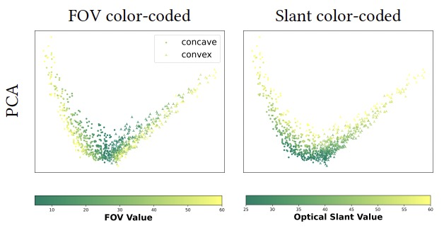

# On Human-like Biases in CNNs for the Perception of Slant from Texture

### Paper | [Poster](https://shorturl.at/guLP6)

## Description
[Yuanhao Wang](https://github.com/HarryWang355),
[Qian Zhang](https://qianzhanginfo.github.io/),
Celine Aubuchon,
Jovan Kemp,
Fulvio Domini,
[James Tompkin](https://jamestompkin.com/)

Official codebase for "On Human-like Biases in Convolutional Neural Networks for the Perception of Slant from Texture".

Paper accepted for publication at ACM Transactions on Applied Perception (TAP).

## Abstract

> Depth estimation is fundamental to 3D perception, and humans are known to have biased estimates of depth.
> This study investigates whether convolutional neural networks 
> (CNNs) can be biased when predicting the sign of curvature and depth of surfaces of textured surfaces under 
> different viewing conditions (field of view) and surface parameters (slant and texture irregularity). 
> This hypothesis is drawn from the idea that texture gradients described by local neighborhoods—a cue identified 
> in human vision literature—are also representable within convolutional neural networks. 
> To this end, we trained both unsupervised and supervised CNN models on the renderings of slanted surfaces with 
> random Polka dot patterns and analyzed their internal latent representations. The results demonstrated that the 
> unsupervised models have similar prediction biases as humans across all experiments, while supervised CNN models do not exhibit 
> similar biases. The latent spaces of the unsupervised models can be linearly separated into axes representing field 
> of view and optical slant. For supervised models, this ability varies substantially with model architecture and the 
> kind of supervision (continuous slant vs. sign of slant). Even though this study says nothing of any shared mechanism, 
> these findings suggest that unsupervised CNN models can share similar predictions to the human visual system.

## Required packages

To run the codes, please install a recent version of Pytorch, and the following packages:
opencv, pandas, matplotlib, argparse, sklearn, scipy, rsatoolbox, statsmodels, datetime.

Todo: create and test a requirements.txt file

## Training Data

We generate training data by rendering random Polka dot textures on surface with concave or convex dihedral angles.
In the first dataset (sample images on the left), we control the camera field of view (FOV) and the optical slant;
in the second dataset (sample images on the right), we additionally add texture irregularity as a controlled variable.

    
    &nbsp; &nbsp; &nbsp; &nbsp;
    

Datasets can be downloaded from [here](https://drive.google.com/drive/folders/1n5_23rYJzJLuRihrzslswOgLKpKk_qUR?usp=sharing). 
Or, they can be generated using our scripts below:

To generate the default dataset, run
    
    python3 gen_data_1.py

To generate the dataset with varying texture irregularities, run

    python3 gen_data_2.py

## Key results
To test whether unsupervised models exhibit human-like perceptual biases for slant estimation from texture cues, we
first rendered a dataset of stimuli images. Next, we trained unsupervised generative CNN models to learn the statistical
distributions of the data, along with supervised equivalent models for comparison. Then, we analyze the internal latent
representations of each model to a) evaluate how stimuli are laid out within it, and to b) assess whether simple distance
measures from linear classifiers on the latent space can produce biased outcomes. Please refer to the paper for more 
detailed results and analyses.

### Physical factors are disentangled in unsupervised model latent spaces

    
    &nbsp; &nbsp; &nbsp; &nbsp;
    

**Left**: We visualize the latent space of the U-Net using PCA (first two principal components).
Data points are color-coded by the FOV or the optical slant values. 

**Right**: We visualize the latent
spaces of all four unsupervised models trained on the dataset with varying texture irregularities, 
with data points color-coded by the texture irregularity level.

### Unsupervised models predict similar biases to humans in convexity and slant prediction.

    、

**(a)** Unsupervised model mean sign of curvature prediction accuracy and mean latent distance (rows) as functions of FOV and optical
slant per FOV (columns). The mean prediction accuracy is 100% when the FOV is above 25◦ and increases with FOV and optical slant
when the FOV is below 25◦. The mean latent distance increases with both FOV and optical slant.

**(b)** Results from human psychophysical study [Todd et al. 2005]. Humans accuracy in judging the sign of curvature also increases
with both FOV and optical slant.

**(c)** The pseudo perceptual gain as a function of the FOV per irregularity level for each tested model. With the exception of the U-Net
that models texture detail primarily through residual connections, all other models produce greater pseudo perceptual gains with
more regular textures.

**(d)** Top row: unsupervised model’s latent distance as a function of the physical slant in concave and convex cases; bottom row: human
psychophysical study results [Todd et al. 2005]. Both the unsupervised model and the human obtain larger perceptual gains from
convex surfaces than from concave surfaces.

### Supervised latent behaviors depend on training setting

    、

We found that the predictions of the supervised models are unbiased, and their latent behaviors depend on the 
model architecture and training settings.

**(a)** We trained the model using the sign of curvature labels (top row) and
physical slant values (bottom row). The latent space of the UNet-based supervised model captures FOV and slant 
regardless of the training objective, and the clustering effect is more
substantial with stronger supervision (slant values).

**(b)** For ResNet18 trained with curvature sign labels, there is a far separation of concave and convex stimuli in the latent space, but
FOV and optical slant are entangled; trained with physical slant labels, optical slant is well disentangled and FOV is better separated.

**(c)** Plots of the latent distance against the FOV for both training objective (rows) and model architectures (columns). U-Net-based
supervised model has smoother curves, indicating a more structured latent space.

**(d)** Pseudo perceptual gain as a function of the FOV per irregularity level for each supervised model (columns) and training objective
(rows). Under both training settings, the supervised U-Net disentangles texture irregularity level and the ResNet fails to do so.

## Reproducing results

### Train unsupervised models

Run the following script for training UNet, UNet- and AE_VGG models:

    python3 train_unsupervised.py --model_name unet --dataset data_exp1  --latent_dim 64 --nb_epochs 50 --sample_interval 25 --save_interval 25 --lr 0.0002 --batch_size 32
"model_name" argument can be one of "unet", "unet-" or "AE_vgg", 
and "dataset" argument can be one of "data_exp1" or "data_exp2".

Run the following script to train the VAE model:

    python3 VAE.py --dataset data_exp1 --latent_dim 64 --nb_epochs 50 --sample_interval 25 --save_interval 25 --lr 0.001 --batch_size 32

### Train supervised models

Run the following script to train supervised models:
    
    python3 train_supervised.py --model_name supervised_sign --backbone unet --dataset data_exp1  --latent_dim 64 --nb_epochs 50 --sample_interval 25 --save_interval 25 --lr 0.0002 --batch_size 32

"model_name" argument can be one of "supervised_sign" or "supervised_slant", each for a different
supervision signal; "backbone" can be one of "unet" or "resnet18"; "dataset" can be one of "data_exp1"
or "data_exp2".

### Analyzing results

Run the following script to analyze results based on data recorded in the log folder:

    python3 result_analysis.py --log_dir train_log/AE_vgg/data_exp1/epoch_50_lr_0.0002_l_dim_64

"log_dir" argument should be replaced by the path to the log folder to be analyzed.